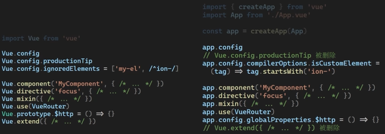
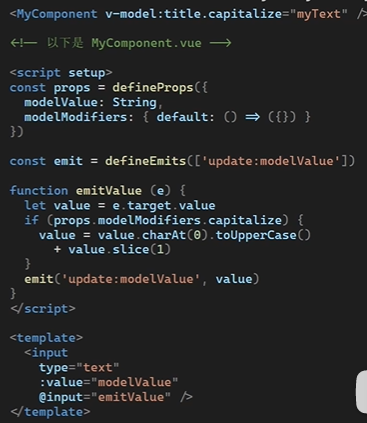
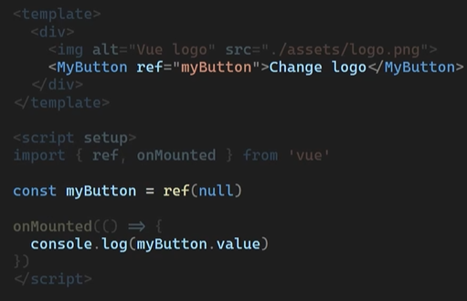

[Vue 3 Migration Guide | Vue 3 Migration Guide (vuejs.org)](https://v3-migration.vuejs.org/)


## Vue3的新功能
-   [复合接口](https://vuejs.org/guide/extras/composition-api-faq.html) -Composition API 
-   [SFC Composition API Syntax Sugar （`<Script setup>`）](https://vuejs.org/api/sfc-script-setup.html)
-   [传送](https://vuejs.org/guide/built-ins/teleport.html)
-   [碎片](https://v3-migration.vuejs.org/new/fragments.html)
-   [发出组件选项](https://vuejs.org/api/options-state.html#emits)
-   [从`@vue/运行时核心``创建呈现器` API](https://vuejs.org/api/custom-renderer.html)，以创建自定义呈现器
-   [SFC 状态驱动的 CSS 变量（`<样式>`中的 `v 绑定`）](https://vuejs.org/api/sfc-css-features.html#v-bind-in-css)
-   [SFC `<样式范围>`现在可以包括全局规则或仅针对已开槽内容的规则](https://github.com/vuejs/rfcs/blob/master/active-rfcs/0023-scoped-styles-changes.md)
-   [悬疑](https://vuejs.org/guide/built-ins/suspense.html)实验


## 全局API变更
### 创建实例

Vue2

```js
import Vue from 'vue'
import App from './App.vue'

const vm = new Vue({
	render: h => h(app)
})

vm.$mount('#app')
```

Vue3

```js
import { createApp } from 'vue'
import App from './App.vue'

const app = createApp(App)

app.mount('#app')
```

### 全局API变更为实例API



| Vue2                                            | Vue3                                                         |
| ----------------------------------------------- | ------------------------------------------------------------ |
| Vue.config                                      | app.config                                                   |
| Vue.config.productionTip                        | 🗑️已删除                                                      |
| Vue.config.ignoredElements = ['my-el', /^ion-/] | app.config.compilerOptions.isCustomElement = (tag) => tag.startsWith('ion-') |
| Vue.componment('MyComponent',{ /* ... */})      | app.componment('MyComponent',{ /* ... */})                   |
| Vue.directive('focus',{ /* ... */})             | app.directive('focus',{ /* ... */})                          |
| Vue.mixin()                                     | app.mixin()                                                  |
| Vue.use()                                       | app.use()                                                    |
| Vue.prototype                                   | app.config.globalProperties                                  |
| Vue.extend                                      | 🗑️已删除                                                      |

#### 在Apps之间共享组件/配置

在应用程序之间共享配置（例如组件或指令）的一种方法是创建工厂函数，如下所示：

```js
import { createApp } from 'vue'
import Foo from './Foo.vue'
import Bar from './Bar.vue'

const createMyApp = (options) => {
  const app = createApp(options)
  app.directive('focus' /* ... */)

  return app
}

createMyApp(Foo).mount('#foo')
createMyApp(Bar).mount('#bar')
```

#### Provide / Inject

```js
// in the entry
app.provide('guide', 'Vue 3 Guide')

// in a child component
export default {
  inject: {
    book: {
      from: 'guide'
    }
  },
  template: `<div>{{ book }}</div>`
}
```

## 默认导出变为命名导出

Vue2

```js
import Vue from 'vue'	//Vue是构造函数
const { nextTick, observable } = Vue
```

Vue3

```js
import { nextTick, observable } from 'vue'
// 或者
import * as Vue from 'vue
// Vue是命名空间
```

## 模板指令变更

### v-model - vue2

#### v-model

>在 2.x 中，在组件上使用 v-model 等效于传递`value`属性并发出`input`事件,

```vue
<ChildComponent v-model="pageTitle"/>
<!-- 等价于 -->
<ChildComponent 
    :value="pageTitle"
     @input="pageTitle = $event" />
```

如果我们想将 prop 或事件名称更改为其他名称，则需要向组件添加一个model选项

```js
export default {
  model: {
    prop: 'title',
    event: 'change'
  },
  props: {
    // this allows using the `value` prop for a different purpose
    value: String,
    // use `title` as the prop which take the place of `value`
    title: {
      type: String,
      default: 'Default title'
    }
  }
}
```

#### `v-bind.sync`

在某些情况下，我们可能需要对属性进行"双向绑定"。

例如，对于使用 prop 的上一个示例，我们可以传达分配新值的意图：`v-model` `update:myPropName` `ChildComponent` `title`

```js
this.$emit('update:title', newValue)
```

然后，父级可以侦听该事件并根据需要更新本地数据属性。例如：

```js
<ChildComponent :title="pageTitle" @update:title="pageTitle = $event" />
```

为方便起见，我们用修饰符为这个模式做了一个简写：`.sync`

```js
<ChildComponent :title.sync="pageTitle" />
```

### v-model - vue3

#### v-model

在 3.x 中，自定义组件相当于传递属性并发出事件：`v-model` `modelValue` `update:modelValue`

> v-bind.sync 和 v-model 合并了

```html
<ChildComponent v-model="pageTitle" />

<!-- would be shorthand for: -->

<ChildComponent
  :modelValue="pageTitle"
  @update:modelValue="pageTitle = $event"
/>
```

要更改model名称，而不是组件选项，现在我们可以将*参数*传递给：`model` `v-model`

```html
<ChildComponent v-model:title="pageTitle" />

<!-- would be shorthand for: -->

<ChildComponent :title="pageTitle" @update:title="pageTitle = $event" />
```


我们在自定义组件上可以使用多个v-model

```html
<ChildComponent v-model:title="pageTitle" v-model:content="pageContent" />

<!-- would be shorthand for: -->

<ChildComponent
  :title="pageTitle"
  @update:title="pageTitle = $event"
  :content="pageContent"
  @update:content="pageContent = $event"
/>
```

#### v-model 自定义修饰符



### 迁移策略

检查代码库的使用情况，并将`.sync`替换为：`v-model`

```html
<ChildComponent :title.sync="pageTitle" />

<!-- to be replaced with -->

<ChildComponent v-model:title="pageTitle" />
```

对于所有没有参数的 .sync，请确保将prop和事件名称分别更改为`modelValue` `update:modelValue`

```html
<ChildComponent v-model="pageTitle" />
```

```js
// ChildComponent.vue

export default {
  props: {
    modelValue: String // previously was `value: String`
  },
  emits: ['update:modelValue'],
  methods: {
    changePageTitle(title) {
      this.$emit('update:modelValue', title) // previously was `this.$emit('input', title)`
    }
  }
}
```

### v-if优先级高于v-for


### v-bind绑定顺序变更

在 2.x 中，如果元素同时定义了两个属性并定义了相同的单个属性，则该单个属性将始终覆盖 v-bind 中的绑定

```js
<!-- template -->
<div id="red" v-bind="{ id: 'blue' }"></div>
<!-- result -->
<div id="red"></div>
```

在 3.x 中，如果元素同时定义了两个属性，并且定义了相同的单个属性，则声明绑定的顺序决定了它们如何合并。换句话说，开发人员不再假设单个属性始终覆盖v-bind 中定义的内容，开发人员现在可以更好地控制所需的合并行为

### 🗑️`v-on.native`

你可能想在某个组件的根元素上监听一个原生事件。可以使用 `v-on` 的修饰符 .native 

通俗点讲：就是在父组件中给子组件绑定一个原生的事件，就将子组件变成了普通的HTML标签，不加'. native'事件是无法触 发的。

可以理解为该修饰符的作用就是把一个vue组件转化为一个普通的HTML标签，并且该修饰符对普通HTML标签是没有任何作用的

**vue2**

```html
<my-component
  v-on:close="handleComponentEvent"
  v-on:click.native="handleNativeClickEvent"
/>
```

**vue3**

未声明在emits中的原生事件会绑定到根元素上

```vue
<my-component
  v-on:close="handleComponentEvent"
  v-on:click="handleNativeClickEvent"
/>
<script setup>
    defineEmits(['close'])
</script>
```

## 组件

### 异步组件

## 渲染函数

**vue2**

```js
// Vue 2 Render Function Example
export default {
  render(h) {
    return h('div')
  }
}
```

h由库提供而不是函数参数

**vue3**

在 3.x 中，现在是全局导入的，而不是作为参数自动传递的

```js
// Vue 3 Render Function Example
import { h } from 'vue'

export default {
  render() {
    return h('div')
  }
}
```

## VNode Props Format

```js
// 2.x
{
  staticClass: 'button',
  class: {'is-outlined': isOutlined },
  staticStyle: { color: '#34495E' },
  style: { backgroundColor: buttonColor },
  attrs: { id: 'submit' },
  domProps: { innerHTML: '' },
  on: { click: submitForm },
  key: 'submit-button'
}
```

在 3.x 中，整个 VNode 道具结构是扁平的

```js
// 3.x Syntax
{
  class: ['button', { 'is-outlined': isOutlined }],
  style: [{ color: '#34495E' }, { backgroundColor: buttonColor }],
  id: 'submit',
  innerHTML: '',
  onClick: submitForm,
  key: 'submit-button'
}
```

## 已删除的Api

### 不再支持使用数字作为v-on的修饰符

在 Vue 2 中

```js
<!-- keyCode version -->
<input v-on:keyup.13="submit" />

<!-- alias version -->
<input v-on:keyup.enter="submit" />
```

此外，您还可以通过全局选项定义自己的别名。`config.keyCodes`

```js
Vue.config.keyCodes = {
  f1: 112
}
<!-- keyCode version -->
<input v-on:keyup.112="showHelpText" />

<!-- custom alias version -->
<input v-on:keyup.f1="showHelpText" />
```

Vue 3中

现在建议对要用作修饰符的任何键使用 kebab-case 名称。

```js
<!-- Vue 3 Key Modifier on v-on -->
<input v-on:keyup.page-down="nextPage">

<!-- Matches both q and Q -->
<input v-on:keypress.q="quit">
```


### 🗑️$chilren 被删除

在 2.x 中，开发人员可以使用以下命令访问当前实例的直接子组件：`this.$children`在 3.x 中，该属性将被删除，不再受支持。相反，如果需要访问子组件实例，我们建议使用[模板引用](https://vuejs.org/guide/essentials/template-refs.html#template-refs)。

即 ref


