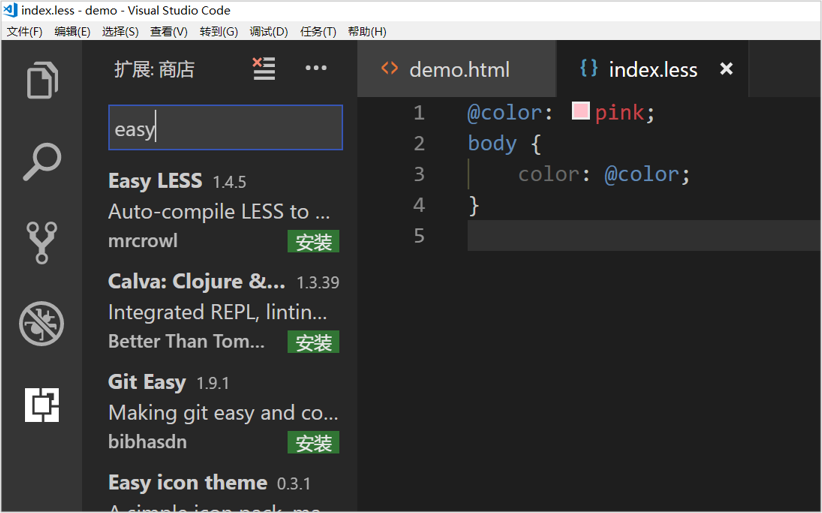
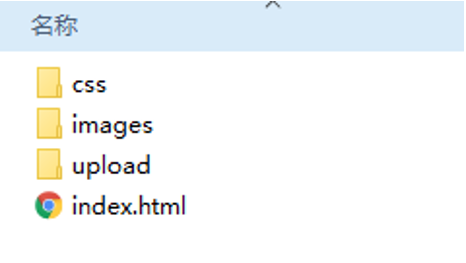
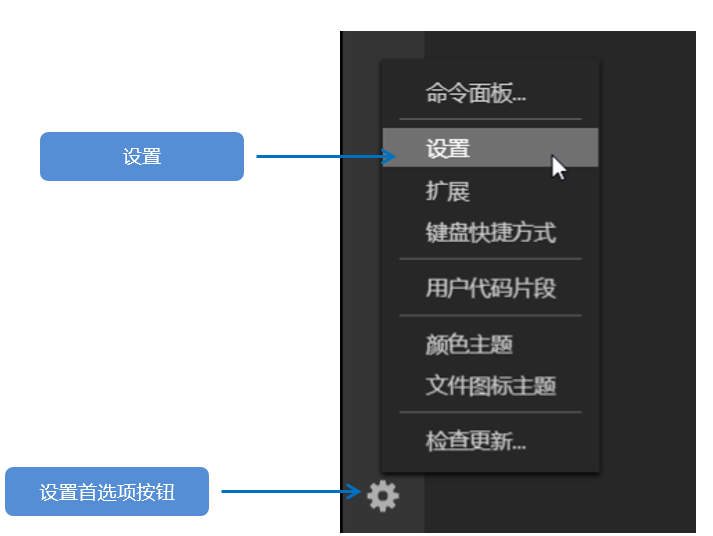
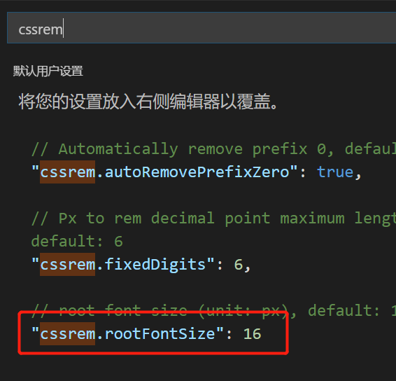

# 移动web开发之rem布局

### rem基础

#### rem单位

rem (root em)是一个相对单位，类似于em，em是父元素字体大小。

不同的是**rem的基准是相对于html元素的字体大小。**           

比如，根元素（html）设置font-size=12px; 非根元素设置width:2rem; 则换成px表示就是24px。

```
/* 根html 为 12px */
html {
   font-size: 12px;
}
/* 此时 div 的字体大小就是 24px */       
div {
    font-size: 2rem;
}
```

rem的优势：父元素文字大小可能不一致， 但是整个页面只有一个html，可以很好来控制整个页面的元素大小。

### 媒体查询

#### 什么是媒体查询

媒体查询（Media Query）是CSS3新语法。

+ 使用 @media查询，可以针对不同的媒体类型定义不同的样式
+ @media 可以针对不同的屏幕尺寸设置不同的样式
+ 当你重置浏览器大小的过程中，页面也会根据浏览器的宽度和高度重新渲染页面 
+ 目前针对很多苹果手机、Android手机，平板等设备都用得到多媒体查询

#### 媒体查询语法规范

+ 用 @media开头 注意@符号
+ mediatype  媒体类型
+ 关键字 and  not  only
+ media feature 媒体特性必须有小括号包含

```
@media mediatype and|not|only (media feature) {
    CSS-Code;
}
```

1. mediatype 查询类型

​       将不同的终端设备划分成不同的类型，称为媒体类型
| 值     | 解释说明             |
| ------ | -------------------- |
| all    | 用于所有设备         |
| print  | 用于打印机和打印预览 |
| screen | 用于电脑屏幕，平板电脑，智能手机等                     |

2. 关键字

​       关键字将媒体类型或多个媒体特性连接到一起做为媒体查询的条件。

+ and：可以将多个媒体特性连接到一起，相当于“且”的意思。
+ not：排除某个媒体类型，相当于“非”的意思，可以省略。
+ only：指定某个特定的媒体类型，可以省略。    

3. 媒体特性

   每种媒体类型都具体各自不同的特性，根据不同媒体类型的媒体特性设置不同的展示风格。我们暂且了解三个。

   注意他们要加小括号包含

  

   

4. 媒体查询书写规则

   注意： 为了防止混乱，媒体查询我们要按照从小到大或者从大到小的顺序来写,但是我们最喜欢的还是从小到大来写，这样代码更简洁

  
   

   也可以设置范围：
   
   ```css
   @media screen and (min-width:450px) and (max-width:500px) {
       body {
           background: -webkit-linear-gradient(left, red, blue);
       }
   }
   ```
   
   

### less 基础

#### 维护css弊端

CSS 是一门非程序式语言，没有变量、函数、SCOPE（作用域）等概念。

+ CSS 需要书写大量看似没有逻辑的代码，CSS 冗余度是比较高的。
+ 不方便维护及扩展，不利于复用。
+ CSS 没有很好的计算能力
+ 非前端开发工程师来讲，往往会因为缺少 CSS 编写经验而很难写出组织良好且易于维护的 CSS 代码项目。 

#### Less 介绍 

Less（LeanerStyle Sheets 的缩写）是一门 CSS扩展语言，也成为CSS预处理器。

做为 CSS的一种形式的扩展，它并没有减少CSS的功能，而是在现有的CSS语法上，为CSS加入程序式语言的特性。

它在CSS 的语法基础之上，引入了变量，Mixin（混入），运算以及函数等功能，大大简化了 CSS 的编写，并且降低了 CSS的维护成本，就像它的名称所说的那样，Less可以让我们用更少的代码做更多的事情。

Less中文网址：[http://](http://lesscss.cn/)[less](http://lesscss.cn/)[css.cn/](http://lesscss.cn/)

常见的CSS预处理器：Sass、Less、Stylus

一句话：Less是一门 CSS 预处理语言，它扩展了CSS的动态特性。

**Less安装**

- 方法1：

①安装nodejs，可选择版本(8.0)，网址：<http://nodejs.cn/download/>

②检查是否安装成功，使用cmd命令（win10是window+r 打开运行输入cmd）  ---输入“node –v”查看版本即可

③基于nodejs在线安装Less，使用cmd命令“npm install -g less”即可

④检查是否安装成功，使用cmd命令“ lessc -v ”查看版本即可

- 方法2：**Less 编译 vocode Less 插件**

**安装 Easy LESS 插件** 用来把less文件编译为css文件

安装完毕插件，重新加载下 vscode。

只要保存一下Less文件，会自动生成CSS文件。



**Less 使用之变量**

变量是指没有固定的值，可以改变的。因为我们CSS中的一些颜色和数值等经常使用。

```
@变量名:值;
```

+ 必须有@为前缀
+ 不能包含特殊字符
+ 不能以数字开头
+ 大小写敏感

```
@color: pink;
```


Less 嵌套

```less
// 将css改为less
#header .logo {
  width: 300px;
}

#header {
    .logo {
       width: 300px;
    }
}

```

如果遇见 （交集|伪类|伪元素选择器） ，利用&进行连接

```less
a:hover{
    color:red;
}
a{
  &:hover{
      color:red;
  }
}
```

Less 运算

任何数字、颜色或者变量都可以参与运算。就是Less提供了加（+）、减（-）、乘（*）、除（/）算术运算。

```
/*Less 里面写*/
@witdh: 10px + 5;
div {
    border: @witdh solid red;
}
/*生成的css*/
div {
  border: 15px solid red;
}
/*Less 甚至还可以这样 */
width: (@width + 5) * 2;

```

+ 乘号（*）和除号（/）的写法  
  + **注意：除法要用括号括起来**
+ 运算符中间左右有个空格隔开 1px + 5
+ 对于两个不同的单位的值之间的运算，运算结果的值取第一个值的单位 
+ 如果两个值之间只有一个值有单位，则运算结果就取该单位


#### 在HTML中直接引用less(知道即可)

1. 修改rel 加入less

   ```html
   < link rel=" stylesheet/less" href="./my.1ess"
   ```

2. 引入一个编译less的js

3. 通过 live server

#### 导入其他less文件

```less
@import 'base.less';
```


#### 注释

```less
//注释只能保存在less文件里，不会保存在css文件里

/*注释可以保存到css文件中，快捷键 Shift + alt + A */  
```


#### 混入(函数)

**1. 不带参数**

```less
//声明函数
.br {
    -moz-border-radius: 40%;
    -webkit-border-radius: 40%;
    -ms-border-radius: 40%;
    -o-border-radius: 40%;
    border-radius: 40%;
}
//调用函数
.box {
    .br()
}
```

**2. 带参数**

```less
//声明函数 @deg为变量
.br(@deg) {
    -moz-border-radius: @deg;
    -webkit-border-radius: @deg;
    -ms-border-radius: @deg;
    -o-border-radius: @deg;
    border-radius: @deg;
}
//调用函数 ，并使用参数
.box {
    .br(40%)
}
```

**3. 带默认值的参数**

```less
//声明函数 @deg为变量,如果在调用时不使用参数，则会使用默认值（40%）
.br(@deg:40%) {
    -moz-border-radius: @deg;
    -webkit-border-radius: @deg;
    -ms-border-radius: @deg;
    -o-border-radius: @deg;
    border-radius: @deg;
}
//调用函数
.box {
    //这里不加参数，会使用默认值 40%
    .br()
}
```


### rem适配方案

1.让一些不能等比自适应的元素，达到当设备尺寸发生改变的时候，等比例适配当前设备。

2.使用媒体查询根据不同设备按比例设置html的字体大小，然后页面元素使用rem做尺寸单位，当html字体大小变化元素尺寸也会发生变化，从而达到等比缩放的适配。

**技术方案：**

**1.less+rem+媒体查询**

**2.flexible.js+rem(推荐)**

总结： 

两种方案现在都存在。

方案2 更简单，现阶段大家无需了解里面的js代码。

#### rem实际开发适配方案1

①假设设计稿是750px

②假设我们把整个屏幕划分为15等份（划分标准不一可以是20份也可以是10等份）

③每一份作为html字体大小，这里就是50px

④那么在320px设备的时候，字体大小为320/15就是  21.33px

⑤用我们页面元素的大小除以不同的 html字体大小会发现他们比例还是相同的

⑥比如我们以750为标准设计稿

⑦一个100*100像素的页面元素在  750屏幕下，  就是 100/ 50  转换为rem  是  2rem*2rem  比例是1比1

⑧320屏幕下，  html字体大小为21.33   则 2rem=  42.66px  此时宽和高都是 42.66  但是宽和高的比例还是 1比1

⑨但是已经能实现不同屏幕下  页面元素盒子等比例缩放的效果

总结：

①最后的公式：页面元素的rem值 =  页面元素值（px） /  （屏幕宽度  /  划分的份数）

②屏幕宽度/划分的份数就是 htmlfont-size 的大小

③或者：页面元素的rem值 =  页面元素值（px） /  html font-size 字体大小

### 苏宁首页

苏宁首页地址 ：[苏宁首页](m.suning.com)

1、 技术选型

方案：我们采取单独制作移动页面方案

技术：布局采取rem适配布局（less + rem  + 媒体查询）

设计图： 本设计图采用 750px 设计尺寸

2、搭建文件结构



3、设置视口标签以及引入初始化样式

```
<meta name="viewport" content="width=device-width, user-scalable=no,         initial-scale=1.0, maximum-scale=1.0, minimum-scale=1.0">

<link rel="stylesheet" href="css/normalize.css">
```

4、设置公共common.less文件

+ 新建common.less    设置好最常见的屏幕尺寸，利用媒体查询设置不同的html字体大小，因为除了首页其他页面也需要
+ 我们关心的尺寸有 320px、360px、375px、384px、400px、414px、424px、480px、540px、720px、750px
+ 划分的份数我们定为 15等份
+ 因为我们pc端也可以打开我们苏宁移动端首页，我们默认html字体大小为 50px，注意这句话写到最上面

### rem 适配方案2

手机淘宝团队出的简洁高效 移动端适配库

我们再也不需要在写不同屏幕的媒体查询，因为里面js做了处理

它的原理是把当前设备划分为10等份，但是不同设备下，比例还是一致的。

我们要做的，就是确定好我们当前设备的html 文字大小就可以了

比如当前设计稿是 750px， 那么我们只需要把 html 文字大小设置为 75px(750px / 10) 就可以

里面页面元素rem值： 页面元素的px 值 /  75  

剩余的，让flexible.js来去算

github地址：[https://github.com/amfe/lib-flexible](https://link.jianshu.com/?t=https://github.com/amfe/lib-flexible)

总结：

因为flexible是默认将屏幕分为10等分

但是当屏幕大于750的时候希望不要再去重置html字体了

所以要自己通过媒体查询设置一下

并且要把权重提到最高

VSCode  px 转换rem 插件 cssrem 

因为cssrem中css自动转化为rem是参照默认插件的16转换的所以需要自己配置



